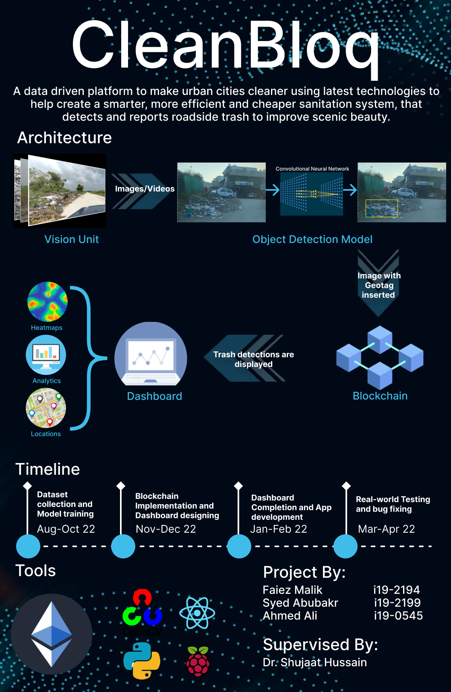

# CleanBloq
A data driven platform to make urban cities cleaner using latest technologies to help create a smarter, more efficient and cheaper sanition system,that detects and reports roadside trash to improve scenic beauty.

This is the final year project of Faiez Malik (i19-2194), Ahmed Ali(i19-0545) and Syed Abu bakr(i19-2199). For detailed overview of project please refer to [doc](https://docs.google.com/document/d/1jJbf3dj8xm4qBMFiTdpSMCSVN5JAHlfWSmLSObL99GU/edit#heading=h.j4v04dp9qdg).

# Poster


# Available Scripts
In this project, you can use
```
npm start
```
Runs the app in the development mode.<br>
Open http://localhost:3000 to view it in the browser.<br>
<br>
The page will reload if you make edits.<br>
You will also see any lint errors in the console.<br>

```
npm run build
```
Builds the app for production to the build folder.<br>
It correctly bundles React in production mode and optimizes the build for the best performance.<br>
<br>
The build is minified and the filenames include the hashes.<br>
Your app is ready to be deployed!<br>
